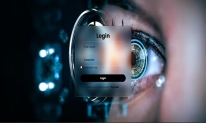

# EYE-HEALTH-CARE-CHATBOT
The Eye Health Care Chatbot is designed to provide personalized assistance and support for both patients and healthcare professionals. It offers reliable and trustworthy information on eye health and vision care, educating users about eye conditions, treatments, and prevention. With 24/7 accessibility, this chatbot ensures valuable support is always available. Additionally, it helps professionals by granting access to resources, guidelines, and updates.

This project focuses on early detection and diagnosis of suspected eye diseases, tailoring information and assistance to meet specific user needs. It provides comprehensive and accurate eye care information, offering guidance from prevention to treatment. The chatbot enhances the overall eye care journey by supporting routine exams, managing conditions, and promoting optimal eye health.

The chatbot is built using Botpress, an open-source framework for conversational AI. Botpress offers pre-built natural language understanding (NLU) components, efficient dialogue management, and multi-platform integration, making it easy to deploy the chatbot across websites, messaging apps, and more. Its ability to understand user queries and engage in meaningful conversations ensures enhanced user satisfaction.

To store user data, the chatbot uses a database with tables structured for storing user inquiries, responses, timestamps, and other relevant information. This ensures effective handling of user input and responses.

The graphical user interface (GUI) is designed with semantic HTML to structure content for improved accessibility and search engine optimization (SEO). Modular CSS organizes styles into components, ensuring scalability and maintainability of the design.
###UI SCREENSHOT

